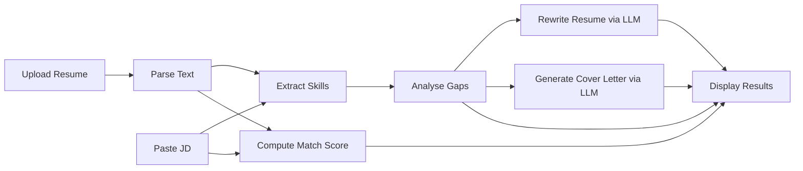

# 🎯 Job Application Intelligence System

An AI-powered web application that analyses your resume against a job description, providing a match score, skill gap analysis, a rewritten resume, and a personalised cover letter.


---

## ✨ Features

| Feature | Description |
|---------|-------------|
| **📊 Match Score** | Semantic similarity score (0–100%) using sentence-transformers embeddings |
| **🔍 Skill Gap Analysis** | Identifies missing skills the JD requires but your resume lacks |
| **✍️ Resume Rewriting** | AI-powered rewrite with improved bullet points tailored to the JD |
| **💌 Cover Letter** | Personalised cover letter generated for the specific role and company |

---

## 🛠️ Tech Stack

- **Resume Parsing**: `pdfminer.six` (PDF) + `python-docx` (DOCX)
- **NLP**: `spaCy` with `en_core_web_sm` model
- **Embeddings**: `sentence-transformers` (`all-MiniLM-L6-v2`)
- **LLM**: Groq API (`llama-3.3-70b-versatile`) — free tier
- **Frontend**: Streamlit

---

## 🚀 Setup & Installation

### 1. Clone the repository

```bash
git clone <your-repo-url>
cd job-ai
```

### 2. Create a virtual environment (recommended)

```bash
python -m venv venv

# Windows
venv\Scripts\activate

# macOS / Linux
source venv/bin/activate
```

### 3. Install PyTorch (CPU-only to save space)

```bash
pip install torch --index-url https://download.pytorch.org/whl/cpu
```

### 4. Install dependencies

```bash
pip install -r requirements.txt
```

### 5. Download the spaCy model

```bash
python -m spacy download en_core_web_sm
```

### 6. Set up your Groq API key

1. Go to [console.groq.com](https://console.groq.com) and create a free account
2. Navigate to **API Keys** and generate a new key
3. Copy `.env.example` to `.env` and paste your key:

```bash
cp .env.example .env
```

Edit `.env`:
```
GROQ_API_KEY=gsk_your_actual_key_here
```

> **💡 Tip:** You can also enter the API key directly in the app's sidebar — it will override the `.env` value for that session.

### 7. Run the application

```bash
streamlit run app.py
```

The app will open at `http://localhost:8501` in your browser.

---

## 📁 Project Structure

```
job-ai/
├── app.py                  # Streamlit frontend — full UI with tabs and styling
├── resume_parser.py        # PDF + DOCX text extraction
├── matcher.py              # Embedding-based semantic match scoring
├── skill_extractor.py      # spaCy NER + keyword-based skill extraction
├── gap_analyser.py         # Missing/matched skill detection
├── rewriter.py             # Groq LLM calls for resume rewriting & cover letters
├── requirements.txt        # All Python dependencies
├── .env.example            # Template for API key configuration
└── README.md               # This file
```

---


---

## ⚙️ How It Works



1. **Parse**: Extracts clean text from your PDF/DOCX resume
2. **Extract**: Identifies skills using spaCy NER + a curated 80+ skill keyword list
3. **Score**: Computes cosine similarity between resume and JD embeddings
4. **Analyse**: Compares extracted skills to find matches and gaps
5. **Rewrite**: Sends resume, JD, and gaps to Groq's Llama 3.3 for intelligent rewriting
6. **Generate**: Creates a personalised cover letter for the specific role

---

## 🔑 Getting a Free Groq API Key

1. Visit [console.groq.com](https://console.groq.com)
2. Sign up with Google, GitHub, or email (completely free)
3. Go to **API Keys** in the left sidebar
4. Click **Create API Key**
5. Copy the key (starts with `gsk_`)
6. Paste it in your `.env` file or the app's sidebar

> **Note:** The free tier provides generous rate limits for personal use.

---

## 🐛 Troubleshooting

| Issue | Solution |
|-------|----------|
| `ModuleNotFoundError: No module named 'spacy'` | Run `pip install -r requirements.txt` |
| `OSError: [E050] Can't find model 'en_core_web_sm'` | Run `python -m spacy download en_core_web_sm` |
| `GROQ_API_KEY` error | Set key in `.env` file or enter in sidebar |
| Torch installation is huge | Use CPU-only: `pip install torch --index-url https://download.pytorch.org/whl/cpu` |
| Port 8501 already in use | Run `streamlit run app.py --server.port 8502` |

---

## 📄 License

This project is released under the MIT License. Feel free to use, modify, and distribute.
